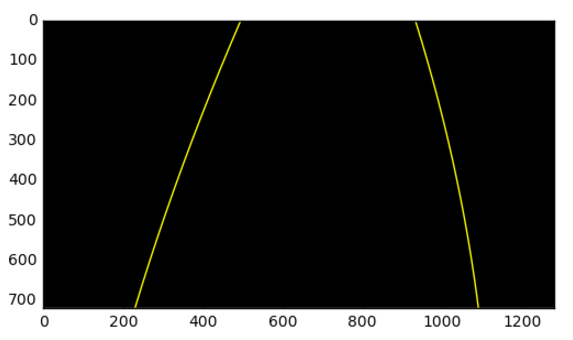
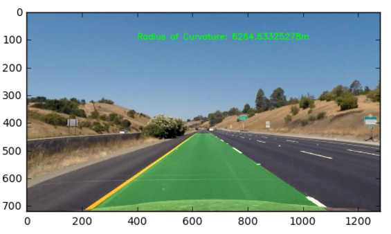
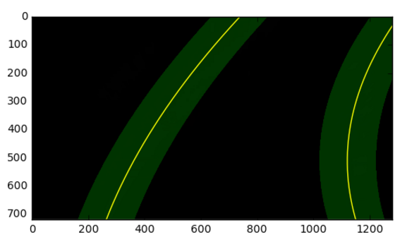
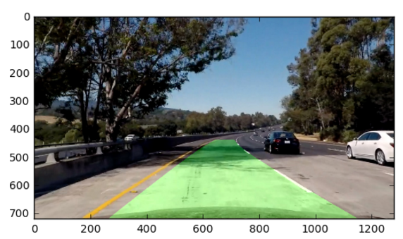

## Advanced Lane Finding Project

**The goals / steps of this project are the following:**

* Compute the camera calibration matrix and distortion coefficients given a set of chessboard images.
* Apply a distortion correction to raw images.
* Use color transforms, gradients, etc., to create a thresholded binary image.
* Apply a perspective transform to rectify binary image ("birds-eye view").
* Detect lane pixels and fit to find the lane boundary.
* Determine the curvature of the lane and vehicle position with respect to center.
* Warp the detected lane boundaries back onto the original image.
* Output visual display of the lane boundaries and numerical estimation of lane curvature and vehicle position.

### This write-up includes the detailed explaination, along with code and output

## Camera Calibration

**This section contains the code on obtaning the camera matrix and distortion coefficients**
1. Prepared object points which is the real world 3-D coordinates.
2. When image points are successfully detected, both image points and object points are appended to the objpoints and imgpoints.
3. Then the camera callibration parameters: ```mtx, dist``` are found using ```  cv2.calibrateCamera(objpoints, imgpoints, img_size,None,None)```.
4. Callibration of the test checkerboard image is shown in figure 1.

#### Figure 1:


## Apply a distortion correction to raw images.

I applied the distortion correction to the test image as shown below

#### Figure 2:


## Combining Thresholds to make Binary Image

1. Using the fuction in  ``` In[11]: mag_thresh``` in the pipeline notebook, I computed the magnitude threshold as shown in figure 3.
2. Using the fuction in  ``` In[12]: grad_threshold``` in the pipeline notebook, I computed the gradent threshold as shown in figure 4.
3. Using the fuction in  ``` In[13]: color``` in the pipeline notebook, I computed the magnitude threshold as shown in figure 5.
5. Finally, I combined all the thresholds together using: ``` combined[((b_map == 1)) | ((color_map == 1) & (grad == 1))] = 1 ``` to create a binary image, as shown in figure 6.

#### Figure 3:


#### Figure 4:


#### Figure 5:


#### Figure 6:


## Perspective Transform

1. I applied an image mask to only select the region of interest using the function ```In[14] region_of_interest ``` as shown in figure 7.

2. Then I computed the perspective transform using the function ``` In[15] corners_unwarp(img, vx1, vx2, vy1, vy2)``` as shown in figure 8.
 

#### Figure 7:


#### Figure 8:


##  Finding the Lines

1. In order to find the lines, first I histogram along all the columns in the lower half of the image from frame 1 using ``` first_lane(image, vertices) ``` like this as shown in figure 9.

2. Then the sliding window approach to find regions near the firstplace where the lines where found to the end of the image. This is done for both left and right lane.

3. Then a second order polynomial is fit to the found regions. This is shown in figure 10.

5. The road curvature is found using the fuction ```In[17] curvature```.

6. Warp the found back to original image space using inverse perspective matrix (Minv). The final result is shown in figure 11.

7. Finally, the function returns the result left fit and right fit.

#### Figure 9:


#### Figure 10:


#### Figure 11:


7. Then, from second frame onwards the left and right fit from previous frames is used. This prevents the use of sliding window, over and over again.

8. Final output is shown in figure 17.

#### Figure 14:


#### Figure 15:


#### Figure 16:


#### Figure 17:



## Discussion

1. This method can clearly fail, if the roads are more curved.
2. Also, in the presence of traffic the lane finding algorithm can get confused.
3. In future work, I would implement the algorithm in order to find lanes in the challenge problems.
